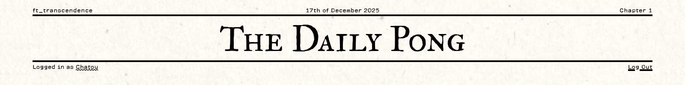
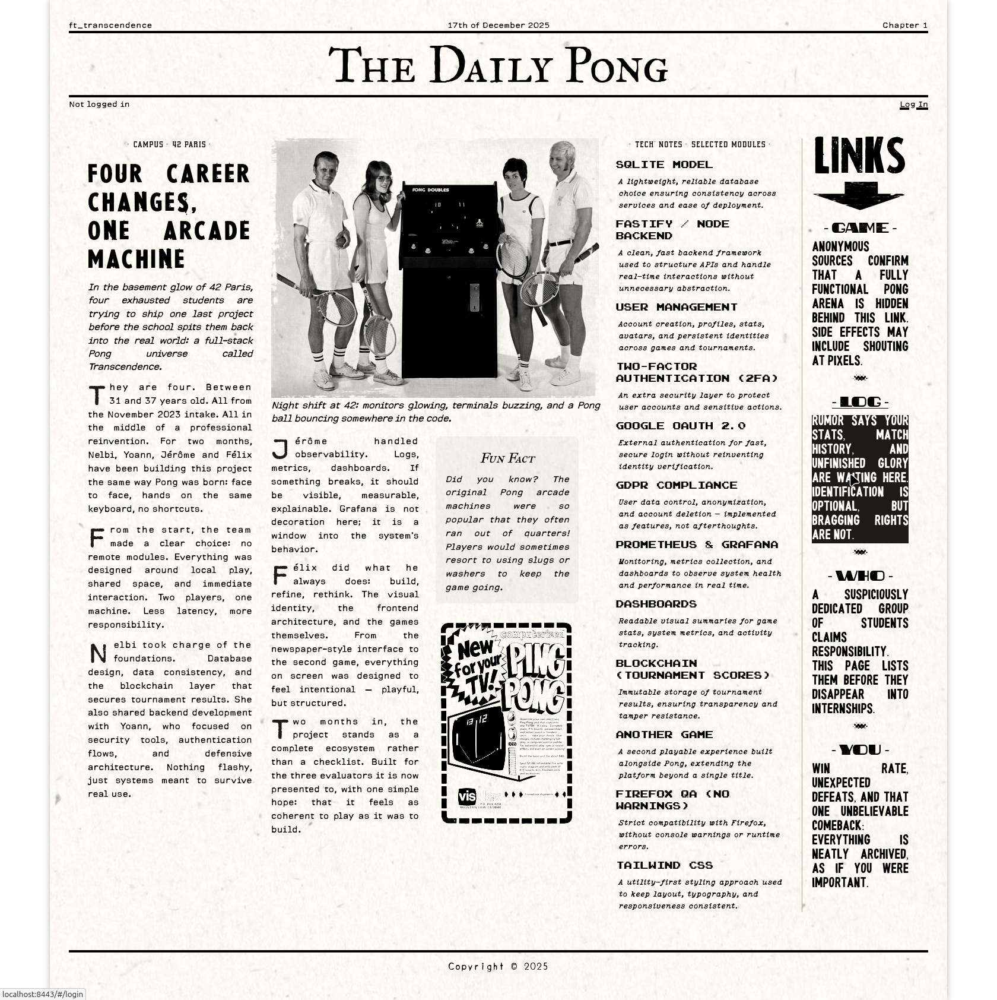
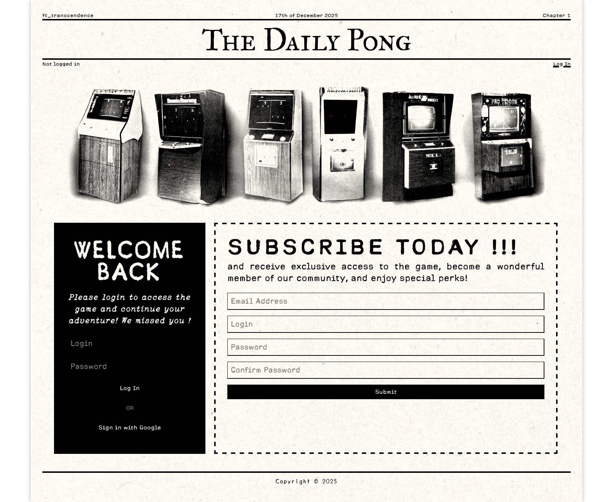
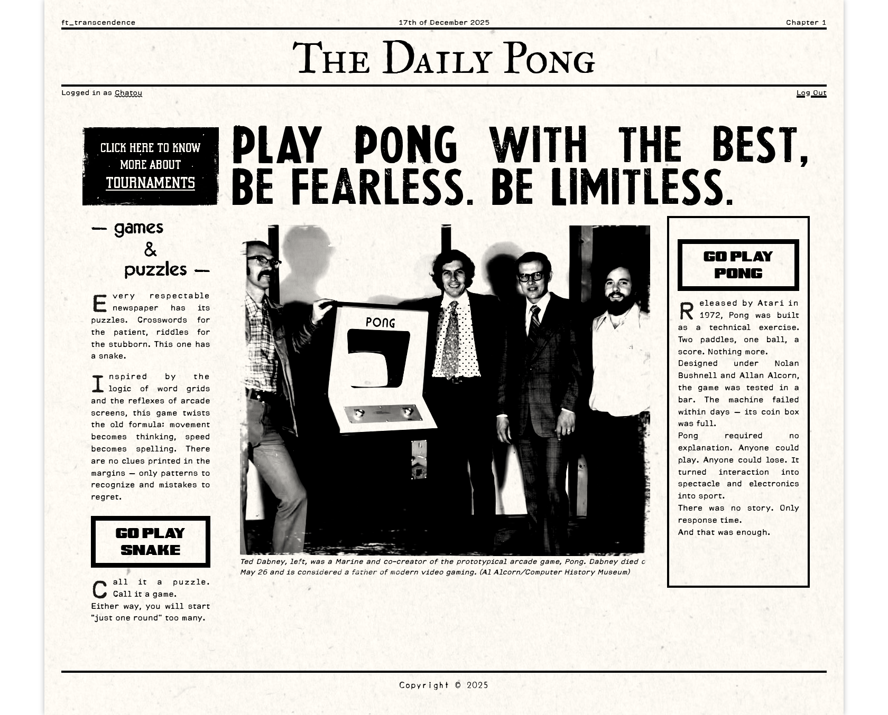
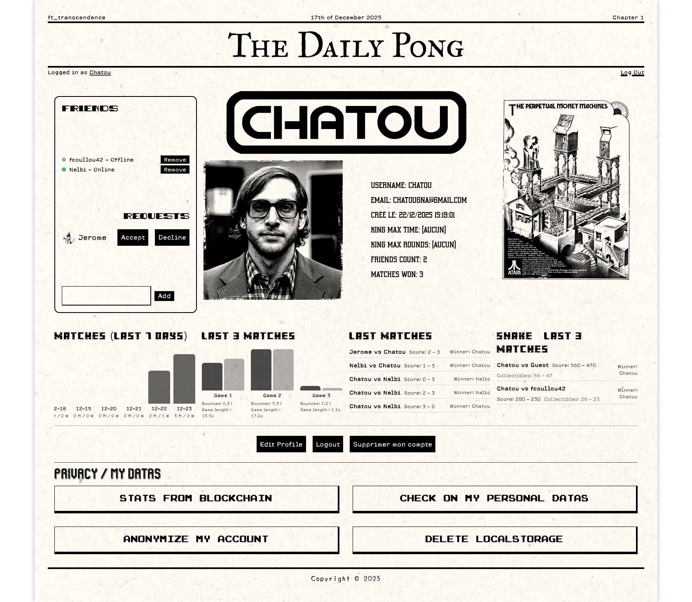
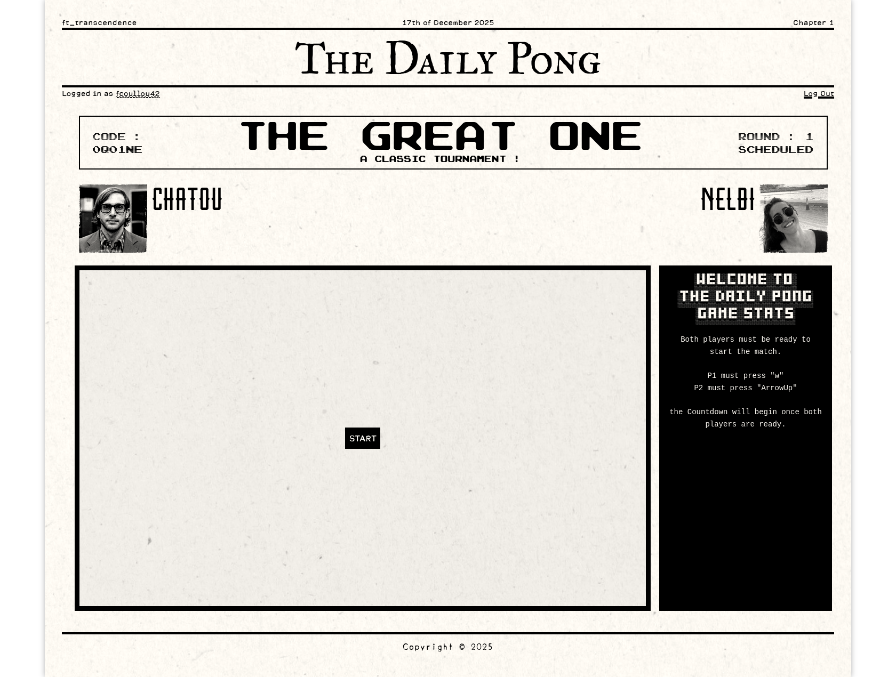

# ft_transcendence  
*Plateforme Web multijoueur en temps réel — jeux, tournois, profils, onboarding guidé.*
<p align="center">
  
</p>
---

## Transcendence ? was ist das ?

Transcendence est le projet final du Common Core de l’École 42.  
Le sujet impose de concevoir une application web autour du jeu Pong, en respectant un socle mandatory strict, puis en choisissant des modules complémentaires pour enrichir le projet.

La partie obligatoire demande notamment :
- une Single Page Application robuste et navigable
- une interface propre et stable, sans erreurs ni warnings
- un jeu Pong jouable, fidèle à l’original
- un système de tournois avec gestion des joueurs et du matchmaking
- une attention particulière portée à la sécurité, à la stabilité et à la compatibilité navigateur

À partir de cette base, nous avons sélectionné plusieurs modules complémentaires (authentification, gestion utilisateur, second jeu, monitoring, etc.), tout en gardant une ligne directrice claire : faire de Transcendence une plateforme arcade moderne, cohérente, lisible et agréable à utiliser.

Plutôt que de chercher à cocher un maximum de cases techniques, nous avons privilégié une vision simple : un projet inspiré de l’arcade classique, centré sur l’expérience locale, le rythme des parties et le plaisir de jeu.

## Mon rôle & implication

Sur ce projet, je me suis occupé de l’intégralité du frontend, ainsi que de la direction artistique globale et de la cohérence UX de l’application.

C’était pour moi l’occasion de consolider mes compétences en TypeScript, Vite et Tailwind CSS, tout en construisant une interface complète, pensée pour être agréable à utiliser du début à la fin.  
J’ai également développé le jeu Pong, l’ensemble du système de tournois et de matchmaking, ainsi qu’une démo jouable d’un second jeu original : CrossWord-Snake. Ce dernier est conçu comme un prototype, avec l’envie de le retravailler plus tard pour en faire un jeu à part entière.

Nous avons fait le choix assumé de ne pas déployer le projet en ligne et de ne pas utiliser de gameplay distant.  
À la place, nous avons adopté une approche volontairement arcade, fidèle à l’esprit de Pong : des parties 1 contre 1 sur une même machine, et des formats de tournois adaptés à cette logique, comme le King of the Hill, où les joueurs s’enchaînent physiquement.

## Home — Direction artistique & structure

<p align="center">
  
  <br>
  <em>Home page — pensée comme une une de journal arcade des années 70</em>
</p>

Dès la page d’accueil, j’ai voulu poser une identité visuelle forte, directement liée au cœur du projet : Pong, le tout premier jeu vidéo.  
L’idée était de transporter l’utilisateur à l’époque de sa création, en adoptant une esthétique de journal papier des années 70, mêlant typographie expressive, mise en page en colonnes et hiérarchie éditoriale très marquée.

La home est structurée comme une véritable page de presse :
- L’article principal présente le projet Transcendence, notre équipe de quatre et le travail fourni.
- La colonne centrale met en avant les choix techniques et les modules sélectionnés.
- La dernière colonne sert de navigation éditoriale vers les différentes sections du site.

Cette approche permet de poser immédiatement le ton : on n’est pas sur une simple application scolaire, mais sur une plateforme arcade cohérente, pensée comme un produit.

## Onboarding & authentification

<p align="center">
  
  <br>
  <em>Onboarding et authentification — première prise en main guidée</em>
</p>

- Authentification via OAuth 42
- Création de profil (alias, avatar)
- Gestion claire des erreurs et retours utilisateur dès l’entrée dans l’application
- 2FA Activable

## Dashboard & navigation

<p align="center">
  
  <br>
  <em>Dashboard — hub central regroupant jeux, tournois et navigation</em>
</p>

- Hub principal servant de point d’entrée à l’application
- Navigation fluide en SPA, sans rechargement
- Accès centralisé aux profils, jeux et tournois

## Profils utilisateurs

<p align="center">
  
  <br>
  <em>Profil utilisateur — identité, statistiques et historique</em>
</p>

- Système social : demandes d’amis, gestion des relations et statuts
- Statistiques persistantes (victoires, défaites, historique)
- Gestion de l’identité utilisateur (GDPR)
- Interface pensée pour rester lisible, même avec beaucoup d’informations

## Jeux — Pong & modules expérimentaux

<p align="center">
  <a href="docs/transcendence/tGame.mp4">
    
  </a>
  <br>
  <em>Pong — gameplay 1vs1 local, inspiré des bornes d’arcade originales (clique pour voir la vidéo)</em>
</p>

<p align="center">
  <a href="docs/transcendence/snake.mp4">
    
  </a>
  <br>
  <em>CrossWord-Snake — prototype de second jeu mêlant logique arcade et réflexion (clique pour voir la vidéo)</em>
</p>

Les jeux de Transcendence sont volontairement pensés pour le jeu local, en cohérence avec l’héritage de Pong et l’esthétique arcade du projet.

- Pong est entièrement codé en TypeScript côté frontend, avec une gestion fine des états de jeu, du score et du rythme des parties.
- CrossWord-Snake est un second module expérimental, conçu comme une démo jouable.

Aucune logique réseau n’est utilisée pour le gameplay : les jeux s’exécutent localement sur une seule machine, mettant l’accent sur la clarté du code, la stabilité des états et l’expérience utilisateur immédiate.

## Architecture & stack technique

Même sans gameplay distant, le projet reste techniquement exigeant et repose sur une architecture complète :

- Single Page Application avec gestion fine des états et de la navigation
- Jeux développés entièrement côté frontend, sans moteur externe
- Logique de tournois et de matchmaking non triviale
- Transitions de jeu, scores et états maîtrisés
- UX travaillée en continu pour rester fluide et compréhensible
- Direction artistique appliquée de manière cohérente sur l’ensemble de l’interface

Technologies utilisées (projet complet) :
- Frontend : TypeScript, Vite, Tailwind CSS
- Backend : Node.js / Fastify
- Base de données : SQLite
- Authentification : OAuth 42
- Monitoring : Prometheus / Grafana
- Conteneurisation : Docker

Les choix backend et infrastructure suivent strictement les contraintes du sujet Transcendence de l’École 42.

## Comment lancer le projet en local

1) **Cloner**
```bash
git clone https://github.com/TheChatou/06_Transcendence.git
cd 06_Transcendence
```

2) **Build & run**
```bash
make prod
```


3) **Ouvrir**
> https://localhost:8080

Note : selon votre machine, il peut être nécessaire de mettre à jour Node.js. Le projet a été développé avec une version récente, et nvm est recommandé :
```bash
curl -o- https://raw.githubusercontent.com/nvm-sh/nvm/v0.39.7/install.sh | bash
source ~/.bashrc   # ou source ~/.zshrc
nvm install 22
nvm use 22
nvm alias default 22
```

Variables d’environnement :  
Les fichiers .env ne sont pas versionnés pour des raisons de sécurité. Si vous souhaitez build ou tester le projet, n’hésitez pas à me contacter pour obtenir les variables nécessaires.

## Liens utiles

- Sujet officiel Transcendence : <a href="en.subject.pdf"> English Subject </a>
- Présentation du projet sur mon portfolio : https://felixcoulloud.vercel.app/#transcendence

---

Ce README a pour but de donner une vision honnête du projet : ce que Transcendence est, les choix qui ont été faits, et la manière dont il a été pensé et construit.
